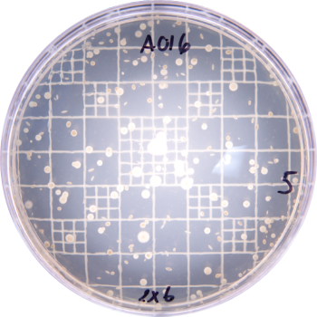
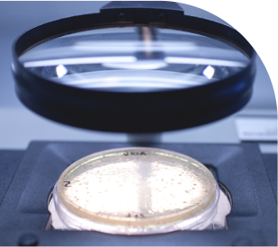
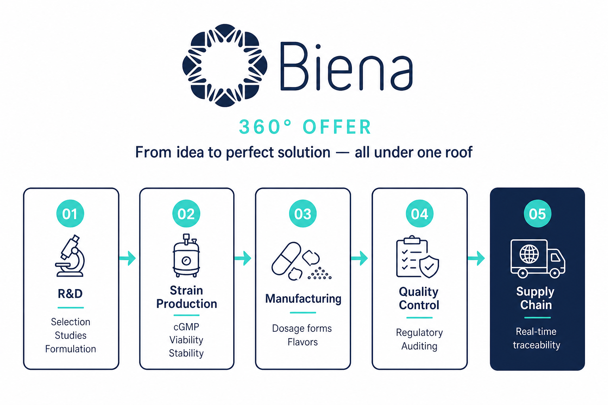
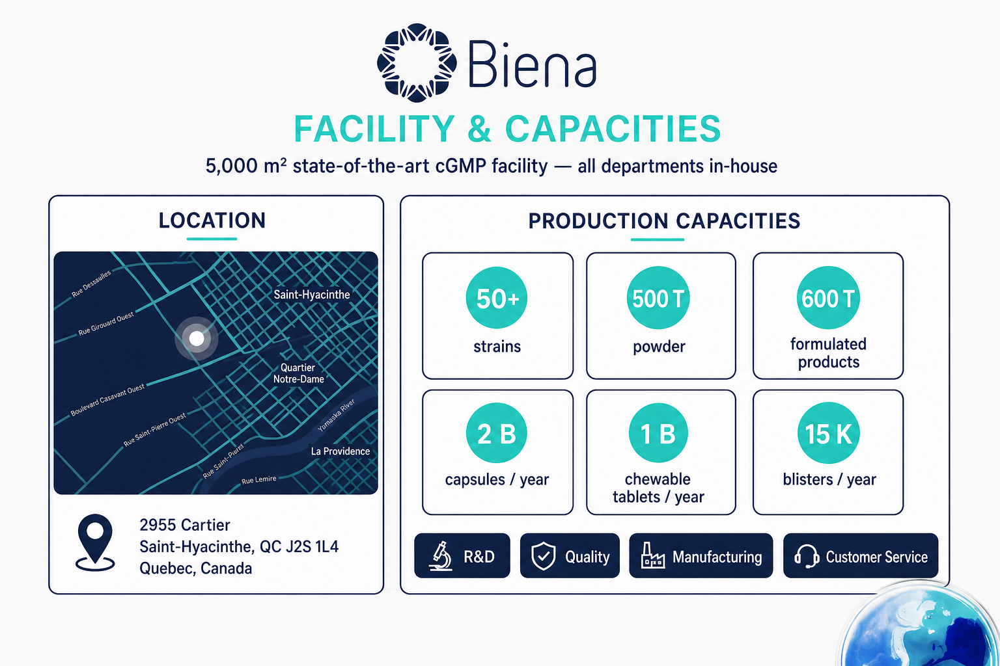

<!-- Banner -->

 

<picture>
  <source media="(prefers-color-scheme: dark)" srcset="./assets/logo-biena.svg">
  <source media="(prefers-color-scheme: light)" srcset="./assets/logo-biena-navy.svg">
  
</picture>

  

<strong>DEDICATED TO QUALITY PROBIOTICS</strong>

 

## From our `strains` to your marketed `product`

 

Leading producer and distributor of bacterial cultures — innovative solutions 
and personalized service from ideation to market readiness. 
<strong>30 years</strong> of expertise since <strong>1996</strong>.

 

  

 

---

 

## About

<table>
<tr>
<td width="60%" valign="top">

Based in <strong>Saint-Hyacinthe, Quebec, Canada</strong>, we support the health and food industries with exceptional probiotic strains and cultures that set brands apart.

We recognize the challenges of launching a new product — every engagement is designed as a <strong>seamless, end-to-end journey</strong> from strain selection to ready-to-market formulation.

<blockquote>

<em>Wellness is embedded in our name. We contribute positively to society and promote <strong>360-degree well-being</strong> — through science, quality, and care.</em>

</blockquote>

</td>
<td width="40%" valign="top" align="center">

</td>
</tr>
</table>

 

---

 

## What sets us apart

<table>
<tr>
<td width="50%" valign="top" align="center">

### Science is our strength

 

<strong>30 years</strong> of production expertise. Our R&D team stays agile — incorporating the latest scientific discoveries to deliver state-of-the-art solutions.

 

</td>
<td width="50%" valign="top" align="center">

### The power of our strains

 

Not your average probiotic. <strong>Naturally sourced, top-quality ingredients</strong> in every dose — backed by <strong>1,000+ characterized strains</strong>.

 

</td>
</tr>
</table>

 

---

 

## Our 360 offer

<em>Everything under the same roof — complete process oversight, from idea to perfect solution.</em>

 

 

 

---

 

## Products

<em>Three product lines — one integrated partner, from strain to shelf.</em>

 

<table>
<tr>
<td width="33%" valign="top" align="center">

 

<strong>1,000+ strains</strong> in our ever-growing bank

 

- Selection and characterization 
- Stability and concentration 
- Custom formula development

 

[**Explore probiotic strains**](https://biena.com/probiotic-strains/)

</td>
<td width="33%" valign="top" align="center">

 

<strong>300+ dairy strains</strong> and vegan alternatives

 

- Cheese, kefir and yogurt cultures 
- Mesophilic and thermophilic strains 
- Non-dairy milk fermentation

 

[**Explore starters and cultures**](https://biena.com/starters-cultures/)

</td>
<td width="33%" valign="top" align="center">

 

<strong>Trademarked solutions</strong> for fast time-to-market

 

- WCFS1, First flora 
- Bioprotics, Protec-IF 
- Yogotherm

 

[**Explore ready-to-market**](https://biena.com/ready-to-market-solutions/)

</td>
</tr>
</table>

 

<strong>Trademark highlights</strong>

 

| Brand | Description |
|:---|:---|
| **WCFS1** | Most independently studied probiotic strain |
| **First flora** | Beneficial bacteria blend isolated from healthy infants |
| **Bioprotics** | Gluten-free, vegan, allergen-free, non-GMO probiotic supplement |
| **Protec-IF** | Targeted infant formula protection |
| **Yogotherm** | Thermophilic culture solutions |

 

---

 

## Facility and capacities

<em>5,000 m² state-of-the-art cGMP facility — R&D, Quality, Manufacturing and Customer service, all in-house.</em>

 

 

 

---

 

## Quality management

<em>We hit the highest standards with full transparency and care.</em>

 

 

- <strong>Inspection and Auditing</strong> - internal and third-party 
- <strong>Regulatory Compliance</strong> - registered in 50+ countries 
- <strong>Intellectual Property</strong> - innovation and protection 
- <strong>Security and Conformance</strong> - testing at every stage 
- <strong>SMETA 4-Pillar</strong> - ethical business practices

 

---

 

## Our commitment

Biena proudly supports the <a href="https://cwf-fcf.org/"><strong>Canadian Wildlife Federation</strong></a> in its mission to protect wildlife and habitat — contributing to a better world for future generations.

 

---

 

## Connect

| **Address** | **Phone** | **Email** | **Hours** |
|:---|:---|:---|:---|
| 2955 Cartier Saint-Hyacinthe, QC J2S 1L4, Canada | [450.778.5505](tel:4507785505) Fax: 450.773.0633 | [info@biena.com](mailto:info@biena.com) | Mon - Fri 8am - 5pm |

 

 

---

 

<picture>
  <source media="(prefers-color-scheme: dark)" srcset="./assets/logo-biena.svg">
  <source media="(prefers-color-scheme: light)" srcset="./assets/logo-biena-navy.svg">
  
</picture>

  

<strong>From our strains to your marketed product.</strong>

 

  

Saint-Hyacinthe, Quebec, Canada - Dedicated to Quality Probiotics

